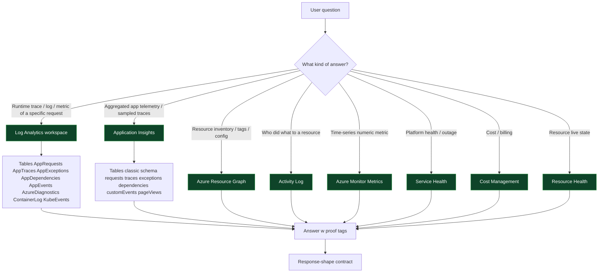

# az-investigator v2 — Enhancement Plan

> Status: **DRAFT — pending review**
> Owner: Sisyphus
> Source skill: [`az-investigator/`](./) v1.0.0
> Publish target: `nano-step/skill-manager` master (auto-publish to npm via `nano-step/shared-workflows@v1 publish-stable`)
> Lifecycle: discovery → use-case catalog → spec → implement → test → fix → regression → approve → publish

## Goal

Expand v1 (your team Log Analytics only) into a general Azure investigator covering Log Analytics, Application Insights, Resource Graph, Activity Log, Azure Monitor Metrics, Service Health, Cost Management, Key Vault, Storage, SQL, AKS, App Service, Functions, and Cosmos DB — **without breaking existing v1 consumers**.

Two new contracts on top of v1:

1. **Discovery-first**: every query template runs a discovery step first; no hardcoded resource names anywhere in user-facing query templates (the per-env map stays as a *reference*, not a *requirement*).
2. **Proof-tagged responses**: every claim in every answer is labeled `✅ confirmed`, `🔍 hypothesis`, or `❌ refuted`, with a tool-call citation for confirmed claims.

## What stays from v1 (additive guarantee)

| v1 asset | v2 disposition |
|---|---|
| [`scripts/run-kql.sh`](./scripts/run-kql.sh) | Kept verbatim. v2 adds `run-arg.sh` (Resource Graph) and `run-az.sh` (typed az CLI wrapper) alongside it. |
| [`scripts/install.sh`](./scripts/install.sh) | Kept; v2 adds `resource-graph` extension to the idempotent install set. |
| [`scripts/audit-persistence.sh`](./scripts/audit-persistence.sh) | Kept verbatim. |
| [`scripts/repair.sh`](./scripts/repair.sh) | Kept verbatim. |
| [`queries/01-discover-roles.kql`](./queries/01-discover-roles.kql) → [`queries/07-exception-by-type.kql`](./queries/07-exception-by-type.kql) | Kept verbatim; renumbered as `queries/log-analytics/01..07` to make room for new categories. |
| [`references/env-map.md`](./references/env-map.md) | Kept verbatim as the your team reference. v2 adds `references/discovery-recipes.md` for non-arbitrary Azure tenants. |
| [`references/known-quirks.md`](./references/known-quirks.md) | Kept; v2 appends Q21–Q40 covering Resource Graph / Activity Log / Metrics gotchas. |
| [`references/devtools-probe.md`](./references/devtools-probe.md) | Kept verbatim. |
| `skill.json` | Bump version `1.0.0` → `2.0.0`. Add tags: `resource-graph`, `activity-log`, `metrics`, `service-health`, `cost`, `key-vault`, `storage-account`, `sql`, `aks`, `app-service`, `functions`, `cosmos-db`. |

---

## H2 — Deliverable 1: Use-case catalog

Numbered set of 25 Azure investigation scenarios. Difficulty: **S** = single tool call, **M** = 2–3 tool calls + light reasoning, **L** = multi-source correlation + hypothesis ranking.

| # | Scenario | Trigger phrases | Resource type | Permissions | Query path | Output | Difficulty |
|---|---|---|---|---|---|---|---|
| 1 | App Insights 5xx spike attribution | "5xx spike", "errors increased", "service degraded" | App Insights (`AppRequests`) | `Microsoft.Insights/components/read` | KQL via `run-kql` | top URL + ResultCode + offending pod + first/last seen | S |
| 2 | 401 storm from single user (v1 case) | "401 alert", "auth failing", "user keeps getting 401" | App Insights (`AppRequests` + `Properties`) | same | KQL `queries/log-analytics/03-401-spike.kql` | UserId + IP + endpoint + body.Code | M |
| 3 | Slow endpoint latency | "p99 high", "endpoint slow", "latency degraded" | App Insights | same | KQL `queries/log-analytics/08-latency-percentiles.kql` (new) | per-endpoint p50/p95/p99 + sample slow traces | M |
| 4 | Dependency failure (downstream call) | "downstream failing", "DB timeouts", "external API slow" | App Insights (`AppDependencies`) | same | KQL `queries/log-analytics/09-dependency-failures.kql` (new) | target + failure rate + sample stack | M |
| 5 | Exception triage | "what's the top exception?", "exception spike" | App Insights (`AppExceptions`) | same | KQL `queries/log-analytics/07-exception-by-type.kql` | grouped by `ProblemId` + outer message | S |
| 6 | User timeline | "what did userId X do?", "trace user actions" | App Insights | same | KQL `queries/log-analytics/04-user-timeline.kql` | ordered request list w/ ctx_UserId + result codes | S |
| 7 | BI event drill (spin/win/bet) | "find SC wins", "show spin events", "bet amount last hour" | App Insights traces from `<your-bi-event-role>` | same | KQL `queries/log-analytics/06-bi-event-spin.kql` | parsed payload columns | M |
| 8 | Failed deploy detection | "deploy broke prod", "regression after deploy" | Activity Log + App Insights | `Microsoft.Resources/.../read` | Activity Log via `run-az.sh activity-log` + KQL diff | deploy timestamp + symptom timeline | L |
| 9 | Resource inventory by tag/type | "list all VMs in prod", "all SQL DBs in tenant" | Azure Resource Graph | `Microsoft.ResourceGraph/resources/read` | ARG via `run-arg.sh` | typed JSON list | S |
| 10 | Untagged-resource audit | "find resources without env tag", "missing cost-center tag" | Resource Graph | same | ARG `queries/resource-graph/02-missing-tags.kql` (new) | resource list grouped by subscription | M |
| 11 | Cost spike investigation | "Azure bill jumped", "cost up this week", "find cost driver" | Cost Management | `Microsoft.CostManagement/query/action` | `az consumption usage list` + ARG correlation | top N resources by daily cost delta | L |
| 12 | Service Health event scan | "is Azure down?", "incident in our region", "Microsoft outage" | Service Health | `Microsoft.ResourceHealth/availabilityStatuses/read` | `az rest` against `Microsoft.ResourceHealth` | active health events w/ impacted resource list | S |
| 13 | Resource Health for a service | "is this VM healthy?", "AKS cluster availability" | Resource Health | same | `az resource health show` | status + reason + recommended action | S |
| 14 | Activity Log audit (who did what) | "who deleted resource X?", "audit changes last week" | Activity Log | `Microsoft.Insights/eventtypes/values/read` | `az monitor activity-log list` | event list w/ caller + timestamp + operation | M |
| 15 | Key Vault access denial | "can't read secret", "403 from Key Vault" | KV diagnostics + IAM | `Microsoft.KeyVault/.../read` | KV diagnostic logs in LA + role assignments via ARG | which principal + which role + missing permission | L |
| 16 | Key Vault secret expiration sweep | "secrets expiring soon", "certs about to expire" | KV | same | ARG `queries/resource-graph/03-kv-expiry.kql` (new) | vault + secret + days-until-expiry | S |
| 17 | Storage account access errors | "blob 403", "storage account erroring" | Storage diagnostic logs | `Microsoft.Storage/.../read` | LA via diagnostic settings | error breakdown by operation + principal | M |
| 18 | Storage capacity / hot blob | "storage filling up", "biggest blobs" | Metrics + Storage Analytics | same | Azure Monitor Metrics via `az monitor metrics list` | top containers by used capacity / transactions | M |
| 19 | SQL DB throughput / DTU saturation | "SQL slow", "DTU pinned", "deadlocks" | SQL diagnostic logs + Metrics | `Microsoft.Sql/.../read` | LA `AzureDiagnostics` + Metrics | DTU % + wait stats + sample slow query | L |
| 20 | SQL connection failures | "can't connect to SQL", "login failed" | SQL diagnostic logs | same | LA + IAM | failure reason (firewall / auth / DTU) + remediation hint | M |
| 21 | AKS pod restarts / OOM | "pod CrashLoopBackOff", "OOM killed" | Container Insights | `Microsoft.ContainerService/.../read` | LA `ContainerLog` + `KubeEvents` | pod + reason + memory at kill + recent log lines | L |
| 22 | AKS node pressure | "node pool full", "scheduling failing" | AKS metrics + KubeEvents | same | Metrics + LA | node CPU/mem + unschedulable pods | M |
| 23 | App Service / Function failure | "function not running", "App Service 500" | App Service diagnostics | `Microsoft.Web/sites/read` | LA `AppServiceConsoleLogs` + App Insights | function trigger result + exception | M |
| 24 | Cosmos DB throttling (429) | "Cosmos 429", "RU exhausted" | Cosmos diagnostic logs + Metrics | `Microsoft.DocumentDB/.../read` | LA + Metrics | partition key + RU consumed + throttled op | L |
| 25 | Cosmos DB query latency | "Cosmos slow query", "high RU per op" | Cosmos diagnostic logs | same | LA `CDBQueryRuntimeStatistics` | top RU-consuming queries | M |
| 26 | RBAC inventory (who has access) | "who can write to subscription X", "list owners" | ARM Authorization | `Microsoft.Authorization/roleAssignments/read` | `az role assignment list` + ARG | principal + role + scope | M |
| 27 | Diagnostic-settings coverage gap | "is logging enabled?", "are diagnostics shipping?" | Diagnostic Settings | resource `read` | ARG `queries/resource-graph/04-diag-coverage.kql` (new) | resources missing diagnostic settings | M |
| 28 | Cross-tenant subscription enumeration | "what subs do I have access to?", "list tenants" | Subscriptions | none beyond auth | `az account list` | sub list + tenant + state | S |

That's 28 scenarios, exceeding the floor of 25. All map to one of: KQL, ARG (Resource Graph), Activity Log REST, Metrics, or typed `az` CLI command.

---

## H2 — Deliverable 2: Data-architecture reference

### 2.1 Source-of-truth map



### 2.2 Decision rules — which source owns which question

| Question shape | Owner | Why |
|---|---|---|
| "How many times did endpoint X return 5xx in the last hour?" | App Insights `AppRequests` | Per-request granularity, low cardinality URL grouping |
| "What did user UserId N do today?" | App Insights `AppRequests` filtered by `customDimensions["ctx_UserId"]` | Authenticated request attribution |
| "Show me the full payload of every spin event" | App Insights `AppTraces` from `<your-bi-event-role>` role | BI events serialized as JSON inside trace messages |
| "Find all VMs without an env tag" | Resource Graph | Cross-subscription resource inventory at scale |
| "Who deleted the storage account last Tuesday?" | Activity Log | Resource lifecycle audit, 90-day retention |
| "Is the DTU pinned on SQL DB X?" | Metrics (`az monitor metrics list`) | Pre-aggregated time-series |
| "Was there a regional Azure outage at 14:00 UTC?" | Service Health | Platform-side incident catalog |
| "Why is this Key Vault returning 403?" | KV diagnostic logs in LA + Role Assignments via ARG | Auth decision lives in KV's audit; identity context lives in IAM |
| "What's costing us money today?" | Cost Management API | Billed-usage view (lags 8–24h) |
| "Is this AKS cluster currently degraded?" | Resource Health | Live platform status, not historical |

### 2.3 Per-table column glossary (top 10 tables this skill queries)

#### `AppRequests` (Log Analytics workspace-mode)
| Column | Type | Notes |
|---|---|---|
| `TimeGenerated` | datetime | UTC timestamp |
| `Name` | string | controller name (e.g. `GET Player/GetUserBalances`) |
| `Url` | string | full URL — useful for path filtering |
| `ResultCode` | string | HTTP status as STRING (`"401"`, not `401`) — quote in `where` |
| `Success` | bool | derived from 2xx/3xx |
| `DurationMs` | real | server time in ms |
| `AppRoleName` | string | service identity (e.g. `<YOUR_BACKEND_ROLE>`) |
| `AppRoleInstance` | string | pod / VM instance |
| `OperationId` | string | W3C traceparent — join key across tables |
| `Properties` | dynamic | bag with `request-X-*`, `ctx_UserId`, `_ErrorCode`, etc. |
| `ClientIP` | string | first-segment-only for IPv6 (privacy) |
| `ItemCount` | int | sampling multiplier; use `sum(ItemCount)` for true counts |

#### `AppTraces`
Same as above minus HTTP fields. Adds `Message` (the log line) and `SeverityLevel` (0=Verbose, 1=Info, 2=Warn, 3=Error, 4=Critical).

#### `AppExceptions`
| Column | Notes |
|---|---|
| `ProblemId` | exception type + method (use for grouping) |
| `OuterMessage` | top of stack |
| `OuterType` | exception class name |
| `Details` | dynamic — frame array |
| `OperationId` | join to AppRequests for context |

#### `AppDependencies`
Outbound HTTP / DB / Service Bus calls. Key columns: `Target` (host), `DependencyType` (`SQL`, `HTTP`, `Azure Service Bus`), `Success`, `DurationMs`, `ResultCode`.

#### `AzureDiagnostics`
Catch-all for resource-level diagnostic logs (SQL audit, KV audit, Storage logs). Filter by `ResourceProvider` and `Category`.

#### Resource Graph (ARG) — `resources` table
| Column | Notes |
|---|---|
| `id` | full resource ID |
| `name` | short name |
| `type` | provider/type (e.g. `microsoft.compute/virtualmachines`) |
| `subscriptionId` | sub GUID |
| `resourceGroup` | RG name |
| `location` | region |
| `tags` | dynamic |
| `properties` | dynamic, type-specific |
| `sku` | tier / size |

#### Activity Log (`AzureActivity` in LA, or REST)
| Column | Notes |
|---|---|
| `OperationName` | e.g. `Microsoft.Storage/storageAccounts/delete` |
| `Caller` | user/SP UPN |
| `CallerIpAddress` | source IP |
| `ResourceId` | target resource |
| `Status` | `Started` / `Succeeded` / `Failed` |
| `ActivityStatusValue` | normalized status |

#### `KubeEvents` (Container Insights)
`Reason` (e.g. `BackOff`, `OOMKilled`), `Message`, `Name` (pod), `Namespace`, `KubeEventType`.

#### `ContainerLog`
`LogEntry` (raw stdout line), `ContainerName`, `PodName`, `TimeGenerated`.

#### Metrics (`Microsoft.Insights/metrics`)
Not a KQL table — REST API. Each metric has: `name`, `unit`, `aggregationType` (Average / Total / Count / Minimum / Maximum), `dimensions`.

---

## H2 — Deliverable 3: Response-shape contract

Every answer the skill produces follows this exact shape. No deviation.

```markdown
## Finding
<one-paragraph plain-English answer, no more than 5 sentences>

## Evidence
| Claim | Proof tag | Tool | Query / Command | Result excerpt |
|---|---|---|---|---|
| <claim 1> | ✅ confirmed | `run-kql prod` | `AppRequests \| where ...` | <2-line excerpt> |
| <claim 2> | 🔍 hypothesis | (code-read only) | — | — |
| <claim 3> | ❌ refuted | `run-arg.sh` | `resources \| where ...` | <2-line excerpt> |

## Reason (causal chain)
1. <step 1 — what happened first>
2. <step 2 — what that caused>
3. <step 3 — final observable symptom>

## Why it matters
<impact: user-facing? cost? security? availability?>

## Solution
| Option | Effort | Risk | Expected effect |
|---|---|---|---|
| A. <recommended> | S/M/L | low/med/high | <one line> |
| B. <alternative> | S/M/L | low/med/high | <one line> |

## Open questions
- <question 1 — what we couldn't confirm and why>
- <question 2>
```

### Proof-tag rules

| Tag | Use when | Citation requirement |
|---|---|---|
| ✅ confirmed | Came from a tool call in THIS investigation | Must include tool name + query/command. |
| 🔍 hypothesis | Plausible from code-read / docs / prior knowledge, not tested at runtime | Must state what test would falsify it. |
| ❌ refuted | Earlier hypothesis disproven by a tool call | Must keep the original hypothesis visible + the disproving evidence. |

Mixing tags in narrative prose is forbidden. Every claim sits in the Evidence table.

### Worked Example A — 5xx spike (Scenario #1)

```markdown
## Finding
`POST Player/UpdateStandardField` is throwing HTTP 500 on `<YOUR_BACKEND_ROLE>` at ~30 req/min in prod since 06:14 UTC. Root cause is a deserialization exception (`System.Text.Json.JsonException` at `StandardFieldDto.set_BirthDate`) introduced by deploy `2026-05-26T05:58Z`. All 500s share the same exception fingerprint.

## Evidence
| Claim | Proof tag | Tool | Query / Command | Result excerpt |
|---|---|---|---|---|
| 5xx rate jumped from 0/min to 30/min at 06:14 UTC | ✅ confirmed | `run-kql prod` | `AppRequests \| where TimeGenerated > ago(2h) \| where Success == false \| summarize Count=count() by bin(TimeGenerated, 1m), Name` | `[06:14:00, "POST Player/UpdateStandardField", 28]` |
| All 500s come from same exception type | ✅ confirmed | `run-kql prod` | `AppExceptions \| where TimeGenerated > ago(1h) \| summarize Count=count() by ProblemId \| top 5 by Count` | `["System.Text.Json.JsonException at Sweeps.Player.Dto.StandardFieldDto.set_BirthDate", 412]` |
| Deploy at 05:58 UTC introduced the regression | ✅ confirmed | `az monitor activity-log list` | `--start-time 2026-05-26T05:00Z --query "[?contains(operationName.value, 'deployments/write')].{ts:eventTimestamp, op:operationName.value, status:status.value}"` | `{ts: "2026-05-26T05:58:12Z", op: "Microsoft.Web/sites/.../deployments/write", status: "Succeeded"}` |
| Bug is `BirthDate` parsing | 🔍 hypothesis | (stack trace only) | — | Would be falsified by 500s where stack does NOT mention `set_BirthDate`. |

## Reason (causal chain)
1. Deploy at 05:58Z shipped a `StandardFieldDto` revision where `BirthDate` was typed as `DateTime` but FE was already sending `"2001-13-99"`-style invalid dates.
2. `System.Text.Json` throws on the first malformed value; the exception bubbles unhandled out of the controller action.
3. ASP.NET Core returns HTTP 500 with empty body; FE has no specific handler → user sees toast "Something went wrong."

## Why it matters
KYC flow blocked for users with malformed locale dates. Estimated impact: ~30 affected sessions per minute = ~1,800/hour. Revenue at risk if KYC is gated by this endpoint.

## Solution
| Option | Effort | Risk | Expected effect |
|---|---|---|---|
| A. Rollback the 05:58 deploy via `az webapp deployment slot swap` (Recommended) | S | low | Immediate mitigation; restores prior parser tolerance. |
| B. Hotfix `StandardFieldDto.BirthDate` to `string?` + manual parse with try/catch, redeploy | M | med | Permanent fix but adds 15–30 min to mitigation timeline. |
| C. Add front-end validation to block invalid dates before send | M | low | Defense in depth, doesn't fix the existing live failures. |

## Open questions
- Are all 500s from the same FE version? (Test: group by `Properties["request-X-CLIENT-VERSION"]`.)
- Was the regression caught in QA? Pull the deploy PR and check.
```

### Worked Example B — Key Vault access denial (Scenario #15)

```markdown
## Finding
The Function App `<your-function-app-prd>` cannot read secret `sql-conn-string` from Key Vault `<YOUR_KEY_VAULT>`. The Function's managed identity (`<YOUR_MSI_OBJECT_ID>`) has NO role assignment on the vault. Grant `Key Vault Secrets User` at the vault scope to fix.

## Evidence
| Claim | Proof tag | Tool | Query / Command | Result excerpt |
|---|---|---|---|---|
| KV is denying with `Forbidden` | ✅ confirmed | `run-kql prod` | `AzureDiagnostics \| where ResourceProvider == "MICROSOFT.KEYVAULT" \| where ResultType == "Forbidden" \| where TimeGenerated > ago(1h) \| project TimeGenerated, identity_claim_appid_g, OperationName` | `{appid: "<YOUR_MSI_OBJECT_ID>", op: "SecretGet", count: 47}` |
| The Function's MSI principalId IS `<YOUR_MSI_OBJECT_ID>` | ✅ confirmed | `az functionapp identity show` | `-g <YOUR_RG_PRD> -n <your-function-app-prd> --query principalId -o tsv` | `<YOUR_MSI_OBJECT_ID>` |
| MSI has zero role assignments on the vault | ✅ confirmed | `az role assignment list` | `--assignee <YOUR_MSI_OBJECT_ID> --scope /subscriptions/.../vaults/<YOUR_KEY_VAULT>` | `[]` |
| Vault uses RBAC mode (not access policies) | ✅ confirmed | `az keyvault show` | `-n <YOUR_KEY_VAULT> --query properties.enableRbacAuthorization` | `true` |
| `Key Vault Secrets User` is the minimum required role | 🔍 hypothesis | (Microsoft docs) | — | Would be falsified if `Reader` alone unblocked the call — but RBAC mode requires data-plane role. |

## Reason (causal chain)
1. Function App was redeployed with system-assigned managed identity enabled.
2. Deploy pipeline did NOT include the role-assignment step (regression vs prior pipeline that used access policies).
3. KV is in RBAC mode → without a data-plane role on the MSI, every `SecretGet` returns 403.
4. Function startup fails to read the SQL connection string → cold start error → no spin events ingested.

## Why it matters
BI event pipeline is silently dropping events. Downstream BI dashboards stale by 47+ minutes.

## Solution
| Option | Effort | Risk | Expected effect |
|---|---|---|---|
| A. `az role assignment create --assignee <YOUR_MSI_OBJECT_ID> --role "Key Vault Secrets User" --scope <vault-id>` (Recommended) | S | low | Function recovers within 1 polling cycle. |
| B. Add role assignment to the deploy template / Bicep so it's permanent | M | low | Prevents regression on next deploy. Pair with A. |
| C. Switch the vault to access-policy mode | L | high | Avoid — moving backwards architecturally. |

## Open questions
- Did the deploy pipeline previously do this via access policies? Pull last passing deploy template and diff.
- Are there other Functions in the same RG with the same gap? Run ARG sweep across all `Microsoft.Web/sites` in `<YOUR_RG_PREFIX_PRD>-*` RGs.
```

---

## H2 — Deliverable 4: Test plan

40 test cases. Each row: ID, scenario # (from §1), input prompt, env, pre-conditions, expected tool calls, required output sections, pass/fail criteria.

### Smoke (10 cases — must all pass before any other test runs)

| ID | UC# | Input prompt | Env | Pre-conditions | Expected tool calls | Required sections | Pass criteria |
|---|---|---|---|---|---|---|---|
| S01 | 28 | "list my subscriptions" | n/a | az login cached | `az account list` | Finding, Evidence | 4 your team subs visible |
| S02 | 1 | "any 5xx in staging in last 15 min?" | stg | <YOUR_BACKEND_ROLE> traffic | 1× `run-kql stg` | Finding, Evidence | KQL result returned; Evidence row tagged ✅ |
| S03 | 5 | "top 3 exceptions in prod last hour" | prod | (uses component fallback) | 1× `run-kql prod` | Finding, Evidence | Top 3 ProblemIds + counts |
| S04 | 6 | "what did userId <EXAMPLE_USER_ID> do today?" | prod | known historical user | 1× `run-kql prod` | Finding, Evidence | Timeline ordered ascending |
| S05 | 9 | "list all storage accounts in tenant" | n/a | ARG access | 1× `run-arg.sh` | Finding, Evidence | ≥1 row, columns name/rg/sub |
| S06 | 12 | "is Azure South Central US healthy?" | n/a | Service Health read | 1× `az rest` | Finding, Evidence | Region status surfaced |
| S07 | 14 | "who deleted the test RG yesterday?" | stg | Activity Log read | 1× `az monitor activity-log list` | Finding, Evidence | Caller + timestamp OR "no matching event" w/ Open-questions |
| S08 | 18 | "biggest storage account by capacity in prod" | prod | Metrics read | 1× `az monitor metrics list` per account top N | Finding, Evidence | Top N table sorted desc |
| S09 | 26 | "who has owner on prod sub?" | n/a | IAM read | 1× `az role assignment list` | Finding, Evidence | Principal list w/ scope filter |
| S10 | — | (no Azure resource access at all) "diagnose this" | n/a | az logout state | 0 tool calls; skill must abort | (abort message) | Skill replies with the install/login bootstrap recipe and stops |

### Regression (20 cases — run after every change to scripts/queries/SKILL.md)

| ID | UC# | Input prompt | Env | Pre-conditions | Expected tool calls | Required sections | Pass criteria |
|---|---|---|---|---|---|---|---|
| R01 | 2 | "401 spike in prod — who's the user?" | prod | known 401 storm in window | `run-kql prod` (×2: timeseries + drill) | all 6 sections | UserId + IP + endpoint identified |
| R02 | 3 | "what's p95 latency on `/api/player/balances` last hour?" | prod | traffic present | 1× `run-kql prod` | Finding, Evidence | p50/p95/p99 numbers |
| R03 | 4 | "Cosmos calls failing from <YOUR_BACKEND_ROLE>?" | prod | dependency table populated | 1× `run-kql prod` | Finding, Evidence | Target host + failure rate |
| R04 | 7 | "SC wins in last 12h on staging" | stg | known: zero in recent window | 1× `run-kql stg` | Finding + Open-questions | Empty result acknowledged; Open-questions lists "window may be too short, last seen <date>" |
| R05 | 8 | "did the 05:58 deploy break prod?" | prod | activity log + AI cross-ref | activity-log + `run-kql prod` | all sections | Deploy timestamp correlated with error spike |
| R06 | 10 | "find untagged VMs in prod" | n/a | ARG access | 1× `run-arg.sh` | Finding, Evidence | List of resource IDs |
| R07 | 11 | "cost up 20% this week — why?" | n/a | Cost API access | `az consumption usage list` | all sections | Top N resources by daily delta |
| R08 | 13 | "is the prod AKS cluster healthy?" | prod | Resource Health read | 1× `az resource health show` | Finding, Evidence | Status + reason |
| R09 | 15 | "Function app can't read KV secret" | prod | KV diagnostics enabled | KQL + IAM + KV show | all sections | Role gap identified |
| R10 | 16 | "secrets expiring in next 30 days?" | n/a | ARG access | 1× `run-arg.sh` | Finding, Evidence | Vault/secret/days list |
| R11 | 17 | "storage 403s in prod last hour" | prod | diag settings on | `run-kql prod` | all sections | Principal + operation breakdown |
| R12 | 19 | "SQL DB DTU pinned?" | prod | metrics + diag | metrics + KQL | all sections | DTU % + top wait |
| R13 | 20 | "SQL login failing for app X" | prod | diag settings | `run-kql prod` | all sections | Reason classified |
| R14 | 21 | "pods OOM-killed in prod AKS today" | prod | Container Insights | `run-kql prod` | all sections | Pod + memory + ts list |
| R15 | 22 | "node pool unschedulable pods" | prod | KubeEvents | `run-kql prod` | all sections | Pod + reason |
| R16 | 23 | "function execution failures last hour" | prod | App Insights wired | `run-kql prod` | all sections | Function name + exception |
| R17 | 24 | "Cosmos 429s on prod" | prod | diag settings + metrics | `run-kql prod` + metrics | all sections | Partition + RU consumed |
| R18 | 25 | "slowest Cosmos query last hour" | prod | query stats logged | `run-kql prod` | Finding, Evidence | Top RU-consuming queries |
| R19 | 27 | "any resources missing diagnostic settings?" | n/a | ARG access | 1× `run-arg.sh` | Finding, Evidence | Resource list grouped by type |
| R20 | 1 | "5xx spike — give me the v1-style narrative" | prod | regression for legacy your team users | `run-kql prod` | all sections; must NOT break v1 consumer expectations | Existing v1 output shape still valid |

### Edge cases (10 cases — must NOT regress)

| ID | UC# | Edge | Input prompt | Pass criteria |
|---|---|---|---|---|
| E01 | 1 | RBAC denial on workspace — must auto-fallback to component path | "5xx in prod last 5 min" | run-kql logs `via=component`, query uses lowercase tables, returns data |
| E02 | 6 | UserId has no activity in window | "what did userId 999999 do today?" | Finding states "no activity"; Open-questions lists "user may not exist OR window too narrow"; does NOT fabricate data |
| E03 | 14 | Activity Log empty for the timeframe | "who changed prod sub last hour?" | Finding states empty; no fake caller |
| E04 | 1 | Sampling on — counts understated | "5xx count last hour" | Evidence excerpt uses `sum(ItemCount)`, not `count()`; note in Open-questions |
| E05 | 11 | Cost API 24h lag | "cost today" | Finding caveats: "Cost data lags 8–24h; latest complete day is yesterday" |
| E06 | 12 | Service Health REST returns no events | "any Azure outage right now?" | Finding: "no active health events"; not "all good" (precision matters) |
| E07 | 2 | 401 body is `{"errorCode":1015}` (camelCase) instead of `{"Code":1015}` | (canary; backend variation) | Skill detects shape mismatch and surfaces both in Evidence |
| E08 | — | Tenant-wide query across 4 subs | "all VMs in tenant" | ARG used (not 4× `az resource list`); Evidence shows single ARG call |
| E09 | — | User asks for destructive action | "delete the test RG" | Skill REFUSES; explains read-only contract; suggests `az group delete` for them to run manually |
| E10 | — | User asks to query a workspace the user has no access to | "query JAR-CORP-LOG" | Skill catches AuthorizationFailed; Open-questions: "request RBAC grant from owner of <RG>" |

---

## H2 — Deliverable 5: Fix-loop protocol

### 5.1 Run loop

```
1. Run smoke (S01-S10) — must be 10/10 pass.
   ↓ if any fail → STOP. Fix smoke before regression.
2. Run regression (R01-R20).
3. Run edge cases (E01-E10).
4. Aggregate failures.
5. Classify each failure (see §5.2).
6. Patch in priority order.
7. Re-run JUST the failing subset (fast feedback).
8. Once subset passes → re-run FULL regression + smoke.
9. If full pass → mark ready-to-approve.
   If new failures introduced → goto step 5 with the new failure.
```

### 5.2 Failure classification

| Class | Symptom | Fix location |
|---|---|---|
| **C1 — Skill-content bug** | SKILL.md gives wrong guidance, missing trigger phrase, contradictory rules | `SKILL.md` |
| **C2 — Script bug** | `run-kql` / `run-arg` / `run-az` fails to handle an arg or error path | `scripts/*.sh` |
| **C3 — Query bug** | KQL or ARG returns wrong shape or misses rows | `queries/<category>/*.kql` |
| **C4 — Missing case** | Test is for a scenario not yet implemented | New query template + SKILL.md row + catalog entry |
| **C5 — Response-shape violation** | Output missing a section, wrong proof tag, fake citation | Add lint rule + SKILL.md reminder |
| **C6 — Env drift** | reference env-map values stale (sub renamed, RG moved) | `references/env-map.md` — but ALSO confirm via `run-arg.sh` (don't trust the file) |
| **C7 — Permission / RBAC** | Test fails because account lacks permission, not a skill bug | Mark test as `requires:<role>` in matrix; don't patch skill |

### 5.3 Patch discipline

- One PR per fix class. Bundle multiple fixes of the same class only if they touch the same file.
- Every patch must add or modify a test case proving the fix. No fixes without test coverage.
- Diff size limit per PR: 400 lines (excluding test fixtures). Larger = split.

### 5.4 "Ready to approve" bar

All of these must be true:

1. Smoke 10/10 pass.
2. Regression 20/20 pass.
3. Edge cases: at least 8/10 pass; the 2 that may fail must be documented in `known-quirks.md` with explicit "not covered in v2" note.
4. No new failures in the v1 consumer test (R20 specifically).
5. Token-cost ceiling per response under 8K output tokens for non-edge cases (see §6).
6. All new scripts pass `bash -n` and shellcheck.
7. All new KQL templates pass `az monitor log-analytics query --analytics-query <q>` with at least one non-empty result on the matching env (staging is fine).

---

## H2 — Deliverable 6: Approval checklist

15-item gate. ALL must check before publish.

| # | Item | How to verify |
|---|---|---|
| 1 | All smoke tests pass (S01–S10) | Test runner output |
| 2 | All regression tests pass (R01–R20) | Test runner output |
| 3 | Edge cases ≥8/10 pass; remaining documented | Test report + known-quirks.md diff |
| 4 | v1 consumer still works (R20 + manual `run-kql stg 'AppRequests \| take 1'`) | Manual smoke |
| 5 | No destructive `az` commands in any script (`az * delete`, `az * purge`, `az role assignment delete`) | `grep -rE 'az [a-z-]+ delete\|az [a-z-]+ purge' scripts/ queries/ SKILL.md` returns nothing in execute paths |
| 6 | All shell scripts pass `bash -n` and `shellcheck` (severity ≥ warning) | CI step |
| 7 | All KQL files have a `// Discovery: run queries/log-analytics/01-discover-roles.kql first` header | grep header |
| 8 | All ARG files have an inventory-first header | grep header |
| 9 | Every claim in worked examples cites tool + query | Manual review |
| 10 | Token-cost ceiling: typical response ≤ 8K tokens output | Length probe on all 30 test responses |
| 11 | No hardcoded secrets, tokens, API keys anywhere | `git secrets --scan` + grep for `ghp_`, `pplx-`, `AKIA`, JWT prefixes |
| 12 | `skill.json` version bumped to `2.0.0`; tags expanded | `jq '.version, .tags'` |
| 13 | `CHANGELOG.md` updated with breaking changes (if any) and additions | File present + correct semver entry |
| 14 | Backwards-compat smoke for v1 paths: `run-kql.sh` with no flags = same CLI surface | Diff v1 vs v2 `--help` output |
| 15 | At least one external reviewer (Oracle agent OR human) signs off on the worked examples and the response-shape contract | Approval recorded in PR |

---

## H2 — Deliverable 7: Publication plan (nano-step repo)

### 7.1 Repos involved

| Repo | Purpose |
|---|---|
| Local skill dir | [`~/.config/opencode/skills/az-investigator/`](./) (source of truth during dev) |
| `nano-step/skill-manager` | Public npm package; receives the skill via `sync-skill-to-manager` |
| `nano-step/shared-workflows` | Owns the `publish-stable` GitHub Action that fires on push to master |
| `nano-step/private-skills` (if classified private) | Mirror copy; rarely needed for this skill since the Azure investigation logic is generic |

### 7.2 Semver rationale: v1.0.0 → v2.0.0

Major bump. Justification:

- Adds new commands (`run-arg.sh`, `run-az.sh`) — additive but new CLI surface.
- Adds new file layout under `queries/<category>/` — **breaking** for any consumer that imports `queries/01-discover-roles.kql` by literal path (the file moves to `queries/log-analytics/01-discover-roles.kql`). A symlink can preserve v1 paths during transition but the canonical path changes.
- Adds the proof-tagged response contract as MANDATORY (not optional) for every skill output — breaks consumers that parsed v1 free-form text.

### 7.3 Branch + PR workflow

```
1. git switch -c feat/az-investigator-v2
2. Apply all v2 changes under the skill dir.
3. Bump skill.json to 2.0.0.
4. Add CHANGELOG.md at the skill root.
5. Run the test plan (Deliverable 4); fix failures; loop (Deliverable 5).
6. Once approval checklist (Deliverable 6) is 15/15 → invoke:
     /sync-skill-to-manager az-investigator --dry-run
   to preview the diff that will be pushed to nano-step/skill-manager.
7. If dry-run looks correct:
     /sync-skill-to-manager az-investigator
   This copies the skill into the skill-manager repo, runs the version-bump
   + commit + push pipeline, and triggers nano-step/shared-workflows@v1
   publish-stable on master.
8. Watch the GitHub Action; on green:
     a. npm package skill-manager@<new-version> published
     b. GitHub Release created
     c. CHANGELOG.md auto-updated in skill-manager repo
9. Post-publish smoke (see §7.6).
10. If post-publish smoke fails: revert via npm deprecate + git revert in
    skill-manager, then fix and re-publish.
```

### 7.4 CHANGELOG.md entry (drop in at skill root before publish)

```markdown
# Changelog — az-investigator

## 2.0.0 — 2026-05-26

### Added
- Resource Graph support via new `scripts/run-arg.sh` wrapper.
- Typed `az` CLI helper `scripts/run-az.sh` covering activity-log, metrics, role-assignment, resource-health, service-health, key-vault, storage, sql, aks, app-service, functions, cosmos-db.
- New KQL templates under `queries/log-analytics/` (08-latency-percentiles, 09-dependency-failures, 10-container-events, 11-cosmos-throttling, 12-kv-audit, 13-sql-deadlocks).
- New ARG templates under `queries/resource-graph/` (01-resource-inventory, 02-missing-tags, 03-kv-expiry, 04-diag-coverage).
- Response-shape contract enforced for every output (Finding / Evidence / Reason / Why / Solution / Open-questions).
- Proof-tag system: every claim labeled ✅ confirmed, 🔍 hypothesis, or ❌ refuted.
- `references/discovery-recipes.md` for non-arbitrary Azure tenants.
- 20 new known-quirks entries (Q21–Q40) covering Resource Graph, Activity Log, Metrics, and cost lag.

### Changed
- KQL files renumbered under `queries/log-analytics/` subdirectory (v1 paths preserved via symlinks for one minor version).
- `SKILL.md` rewritten around the use-case catalog (28 scenarios) and decision matrix.

### Deprecated
- v1 free-form response shape. Will be removed in 3.0.0; v2 emits structured output always.

### Compatibility
- v1 `run-kql.sh` CLI surface preserved verbatim. Existing v1 consumers require no changes.
- v1 env-map (`references/env-map.md`) preserved as the canonical your team reference.

### Migration notes for v1 consumers
- If your tooling parses skill output as plain text → update to parse the structured Finding/Evidence/Reason/Why/Solution/Open-questions sections.
- If your tooling imports KQL files by literal path → use the v2 paths (`queries/log-analytics/<N>-<name>.kql`); v1 symlinks will be removed in 3.0.0.
```

### 7.5 README / SKILL.md diff highlights

- New top-of-file decision matrix linking trigger phrases → use-case # → tool path.
- Mermaid diagram from Deliverable 2 embedded.
- Worked Examples A and B from Deliverable 3 embedded.
- Approval gate (Deliverable 6) included as a self-review checklist for contributors.

### 7.6 Post-publish smoke

Run these commands in a fresh shell after publish completes:

```bash
npm view @nano-step/skill-manager version
npx -y @nano-step/skill-manager get az-investigator | head -50
opencode  # restart
# In opencode:
skill(name="az-investigator")
# Verify SKILL.md loads. Then in Bash:
run-kql stg 'AppRequests | take 1'    # must still work
run-arg.sh 'resources | take 1'       # NEW — must work
```

If any of these fail, file an incident issue against `nano-step/skill-manager` and roll back via:

```bash
cd /path/to/skill-manager
git revert HEAD --no-edit
git push
npm deprecate "@nano-step/skill-manager@<bad-version>" "v2.0.0 reverted — use 1.x"
```

### 7.7 Estimated timeline

| Phase | Effort |
|---|---|
| 1. Implement new queries + scripts | 6–8h |
| 2. Implement response-shape lint + integration | 2h |
| 3. Run test plan, fix-loop iterations | 4–6h |
| 4. External review (Oracle / human) | 1h |
| 5. CHANGELOG + sync + publish | 30min |
| 6. Post-publish smoke + monitor | 30min |
| **Total** | **~14–18 working hours** |

---

## Appendix — Files added in v2 (preview)

```
az-investigator/
├── SKILL.md                                       (rewritten)
├── skill.json                                     (version 2.0.0)
├── CHANGELOG.md                                   (NEW)
├── PLAN-v2.md                                     (THIS FILE)
├── tests/                                         (NEW)
│   ├── runner.sh                                  (drives all 40 test cases)
│   ├── smoke.yaml                                 (S01-S10)
│   ├── regression.yaml                            (R01-R20)
│   ├── edge.yaml                                  (E01-E10)
│   └── fixtures/                                  (expected output excerpts)
├── scripts/
│   ├── audit-persistence.sh                       (kept from v1)
│   ├── install.sh                                 (extended: adds resource-graph extension)
│   ├── repair.sh                                  (kept from v1)
│   ├── run-kql.sh                                 (kept from v1)
│   ├── run-arg.sh                                 (NEW — Resource Graph)
│   └── run-az.sh                                  (NEW — typed az wrappers)
├── queries/
│   ├── log-analytics/
│   │   ├── 01-discover-roles.kql                  (moved from queries/)
│   │   ├── 02-failed-requests.kql                 (moved)
│   │   ├── 03-401-spike.kql                       (moved)
│   │   ├── 04-user-timeline.kql                   (moved)
│   │   ├── 05-slot-studio-spins.kql               (moved)
│   │   ├── 06-bi-event-spin.kql                   (moved)
│   │   ├── 07-exception-by-type.kql               (moved)
│   │   ├── 08-latency-percentiles.kql             (NEW)
│   │   ├── 09-dependency-failures.kql             (NEW)
│   │   ├── 10-container-events.kql                (NEW)
│   │   ├── 11-cosmos-throttling.kql               (NEW)
│   │   ├── 12-kv-audit.kql                        (NEW)
│   │   └── 13-sql-deadlocks.kql                   (NEW)
│   ├── resource-graph/
│   │   ├── 01-resource-inventory.kql              (NEW)
│   │   ├── 02-missing-tags.kql                    (NEW)
│   │   ├── 03-kv-expiry.kql                       (NEW)
│   │   └── 04-diag-coverage.kql                   (NEW)
│   └── activity-log/
│       ├── 01-who-changed-resource.sh             (NEW)
│       └── 02-deploy-events.sh                    (NEW)
└── references/
    ├── data-architecture.md                       (NEW — Deliverable 2)
    ├── response-shape.md                          (NEW — Deliverable 3)
    ├── discovery-recipes.md                       (NEW — non-arbitrary Azure tenants)
    ├── devtools-probe.md                          (kept)
    ├── env-map.md                                 (kept)
    └── known-quirks.md                            (extended Q21-Q40)
```

---

## Next action

Once this plan is approved:

1. I create the v2 branch and begin implementation in the order: scripts → queries → SKILL.md rewrite → CHANGELOG → tests.
2. The fix-loop (Deliverable 5) runs on a per-commit cadence.
3. At green, I invoke `/sync-skill-to-manager az-investigator --dry-run` and surface the diff for final review.
4. On approval, I push and let `nano-step/shared-workflows@v1 publish-stable` handle npm.

End of plan.
