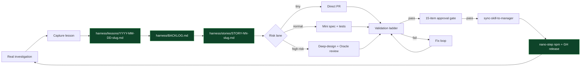

# az-investigator Harness

> Status: **active** — initialized 2026-05-26
> Owner: Sisyphus
> Scope: only this skill (`az-investigator/`). Not a workspace-wide harness.
> Lifecycle: lesson → story → spec → implement → test → fix → regression → approve → publish

## Purpose

Every time `az-investigator` is used in a real investigation, we learn something. Without a process, those lessons evaporate or get re-discovered the hard way (lesson #1 in `references/known-quirks.md` is literally this — I discovered the same `findmnt` quirk twice in one week before writing it down).

This harness gives that "evaporating wisdom" a place to live and a path to ship.



## What the harness owns

| Artifact | Path | Purpose |
|---|---|---|
| Lesson catalog | [`harness/LESSONS_INDEX.md`](LESSONS_INDEX.md) | Searchable index of every captured lesson |
| Open backlog | [`harness/BACKLOG.md`](BACKLOG.md) | Lessons not yet promoted to a story |
| Stories | `harness/stories/STORY-NN-<slug>.md` | A lesson promoted into an actionable change |
| Postmortems | `harness/lessons/YYYY-MM-DD-<slug>.md` | Raw lesson capture (the "wet" record) |
| Templates | `harness/templates/` | The shape of each artifact |
| Scripts | `harness/scripts/` | Capture, promote, validate, gate-check, publish |
| Evidence | `harness/evidence/` | Test artifacts, screenshots, query outputs |
| Test suite | `harness/tests/` | The 40-case matrix from `PLAN-v2.md` Deliverable 4 |

## Risk lanes

Same three lanes used across the rest of the workspace.

| Lane | Trigger | Required artifacts | Reviewer | Time budget |
|---|---|---|---|---|
| **tiny** | Single-file edit, no behavior change for v1 consumers, no new dependency | Story + 1 test | Self | ≤ 30 min |
| **normal** | New query / new script / SKILL.md section, additive only | Story + spec section + ≥ 2 tests | Oracle agent (read-only) | ≤ 4h |
| **high-risk** | Breaks v1 contract, removes a file, changes response-shape, touches publish path | Story + deep-design + spec + ≥ 5 tests + Momus review | Momus + human | ≤ 2 days |

**Default to higher lane when in doubt.** A "tiny" fix that breaks R20 (v1 v1 regression) is a high-risk fix mislabeled.

## Hard gates (every change crosses these)

1. **v1 consumer regression**: `run-kql stg 'AppRequests | take 1'` returns 200 ✅
2. **Response-shape contract**: every new output template has the 6 mandatory sections (Finding / Evidence / Reason / Why / Solution / Open-questions)
3. **Proof-tag discipline**: every claim in every doc / worked example uses ✅ / 🔍 / ❌
4. **No destructive `az` commands** in execute paths (`az * delete`, `purge`, `revoke`, force-write role assignments)
5. **Discovery-first**: no hardcoded resource names in user-facing query templates (env-map.md as reference is fine)

These are enforced by [`harness/scripts/gate-check.sh`](scripts/gate-check.sh).

## Change types

| Type | Example | Lane defaults to | Requires lesson? |
|---|---|---|---|
| `skill-content` | Edit SKILL.md guidance | tiny | yes (the lesson driving it) |
| `script` | Modify run-kql.sh, install.sh | normal | yes |
| `query` | Add / edit a KQL or ARG template | normal | yes |
| `response-shape` | Change the mandatory output sections | **high-risk** | yes + Momus review |
| `test` | Add / update a test case | tiny | optional |
| `lesson` | Capture a new postmortem only (no code change yet) | tiny | n/a (this IS the lesson) |
| `publish` | Bump semver, push to nano-step | normal (after gate pass) | n/a (gate is the gate) |

## Workflow

### Capture (after every real investigation)

```bash
bash harness/scripts/capture-lesson.sh
# Interactive prompts:
#   - One-line summary
#   - Trigger phrase that would re-find this
#   - Tool / file / quirk it pertains to
#   - Severity (cosmetic / annoying / data-corrupting)
#   - Did this cost me >5 minutes the first time? [y/n]
# Writes: harness/lessons/YYYY-MM-DD-<slug>.md
# Appends a row to: harness/LESSONS_INDEX.md
# Appends to: harness/BACKLOG.md (if severity > cosmetic)
```

### Promote (when a lesson is ripe for a code change)

```bash
bash harness/scripts/promote-to-story.sh harness/lessons/2026-05-26-takelatest-cancels-modal.md
# Prompts:
#   - Lane: tiny / normal / high-risk
#   - Change type
#   - Linked v2 plan section (if any)
# Writes: harness/stories/STORY-NN-<slug>.md
# Updates BACKLOG.md (lesson → "in progress" link to story)
```

### Implement → Validate

```bash
bash harness/scripts/run-tests.sh smoke         # S01-S10
bash harness/scripts/run-tests.sh regression    # R01-R20
bash harness/scripts/run-tests.sh edge          # E01-E10
bash harness/scripts/run-tests.sh all
```

### Gate-check (before publish)

```bash
bash harness/scripts/gate-check.sh
# Walks the 15-item approval checklist from PLAN-v2.md Deliverable 6.
# Exits 0 only if all gates pass. Prints per-gate verdict + evidence path.
```

### Publish

```bash
/sync-skill-to-manager az-investigator --dry-run
/sync-skill-to-manager az-investigator
```

The downstream `nano-step/shared-workflows@v1 publish-stable` workflow handles npm publish + GitHub Release.

## Best practices baked in (from prior postmortems)

| BP | Source lesson | Enforced where |
|---|---|---|
| BP-1: Use `stat -c '%D'`, not `findmnt`, for persistence | Q1 (known-quirks) | `scripts/audit-persistence.sh` |
| BP-2: Never hardcode resource names — discover first | Q9 (known-quirks) | `gate-check.sh` rule "no hardcoded resource names in queries/" |
| BP-3: Mark every claim ✅ / 🔍 / ❌ | Postmortem from session 2026-05-26 | `lint-response-shape.sh` |
| BP-4: Newly installed MCPs need opencode restart | Q4 (known-quirks) | `install.sh` end-of-run message |
| BP-5: `fetch()` defaults to disk cache — use `cache:'no-store'` | Q13 (known-quirks) | `references/devtools-probe.md` |
| BP-6: Distinguish workspace-mode (AppRequests) vs component-mode (requests) | Q5 (known-quirks) | `run-kql.sh` fallback message |
| BP-7: One PR per fix class, ≤400 lines, test added with fix | PLAN-v2.md §5.3 | `gate-check.sh` |
| BP-8: Use `takeLatest` + side-effects = cancellation risk; prefer `spawn` or `putResolve` | Q16 (known-quirks) | `lint-response-shape.sh` flags any new saga-yield response code |
| BP-9: Capture lesson immediately, not "later" | This file's existence | `capture-lesson.sh` invoked at end of every investigation |
| BP-10: Default to higher risk lane when uncertain | PLAN-v2.md §1 | `promote-to-story.sh` default = `normal` |

## Files in the harness

```
harness/
├── HARNESS.md                          (this file — the spec)
├── LESSONS_INDEX.md                    (table-of-contents for lessons)
├── BACKLOG.md                          (open lessons + in-progress stories)
├── lessons/                            (postmortem captures)
│   └── 2026-05-26-*.md                 (10 seed lessons from session that produced v1 + plan)
├── stories/                            (lesson-promoted actionable items)
│   └── STORY-01-*.md                   (will be created as needed)
├── templates/
│   ├── lesson.md                       (postmortem template)
│   ├── story.md                        (story template)
│   └── postmortem.md                   (longer-form RCA template for high-risk)
├── scripts/
│   ├── capture-lesson.sh               (interactive lesson capture)
│   ├── promote-to-story.sh             (lesson → story)
│   ├── run-tests.sh                    (smoke / regression / edge / all)
│   ├── lint-kql.sh                     (KQL syntax probe via az)
│   ├── lint-response-shape.sh          (validates 6-section template)
│   └── gate-check.sh                   (15-item approval gate)
├── evidence/                           (test outputs, screenshots, query results)
│   └── README.md
└── tests/                              (test matrix definitions)
    ├── smoke.yaml                      (S01-S10)
    ├── regression.yaml                 (R01-R20)
    └── edge.yaml                       (E01-E10)
```

## When this harness is NOT the right tool

- For one-off ad-hoc Azure queries that don't need to become reusable: just run `run-kql` directly. Capture a lesson if (and only if) you hit a quirk that future-you would benefit from knowing.
- For investigations into other Azure tenants / workspaces NOT covered by `references/env-map.md`: use the skill, but the lesson goes into the team-private knowledge base, not into this public skill.
- For workflow improvements to OTHER skills: each skill should have its own harness; don't cross-contaminate.

## How this evolves

The harness itself follows its own lanes:

- Adding a new lesson template field → `tiny`
- Adding a new validation script → `normal`
- Changing the lane definitions or hard gates → `high-risk` (needs Momus review)

The metric for this harness's success: **mean time from "I hit a quirk in real work" to "the quirk is documented and a regression test prevents it" < 24 hours**.
